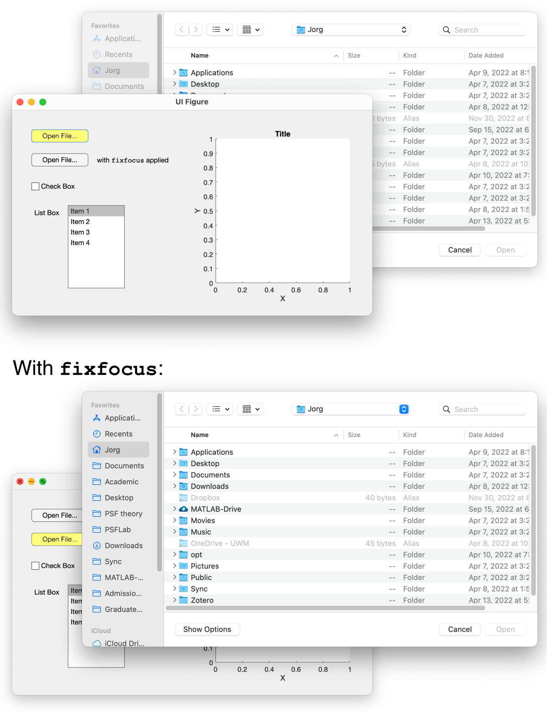
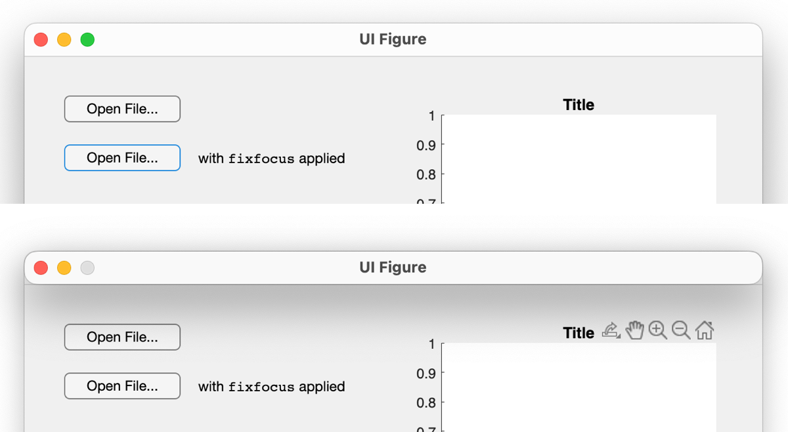

[](https://www.mathworks.com/matlabcentral/fileexchange/59695-detectos)

# fixfocus

**fixfocus** provides a workaround for an annoying, long-standing MATLAB user interface bug that occurs when selection dialog boxes are opened from app window or `uifigure` callback functions.

## Background

Since at least R2016b, MATLAB does **not** move the selection dialog box into focus when called from an app or `uifigure` callback. Instead, the selection dialog box appears **behind** the app or `uifigure` window (in the worst case, it may be completely covered by it):



`fixfocus` provides a workaround that automatically brings the selection dialog box into focus. 

It also returns the focus to the calling app or `uifigure` window once the user has made their selection -- thus fixing a second user interface bug that has persisted in MATLAB.

## Usage

In your app window's or `uifigure`'s callback function, sandwich the call to your selection dialog box (such as a call to `uigetfile`) between the following two lines:

```matlab
ff = fixfocus;
% 'uigetfile', 'uitputfile', 'uigetdir', 'uiopen', or 'uisave' command
delete(ff);
```

This applies to `uigetfile`, `uitputfile`, `uigetdir`, `uiopen`, and `uisave` calls.

## How It Works

Internally, `fixfocus` creates a temporary dummy `figure`, which takes the focus away from the app window or `uifigure` window containing the callback. This allows the selection dialog box to move into focus when called.

To be as unobtrusive as possible, the dummy `figure` consists of just the title bar (zero height), perfectly superimposed on top of the title bar of the calling app or `uifigure` window:



This title bar only appears for a fraction of a second. 

As an option, a short message text (such as "Just a second...") can be passed as an argument to `fixfocus`, which is then displayed in the title bar instead of the app or `uifigure` title.

> [!NOTE]  
> Other potential workarounds, such as moving the dummy figure off the screen, making it invisible from the start, shrinking it to zero width and height, etc., are unfortunately not working as expected. Also, there is currently no official workaround from The MathWorks regarding these bugs.

## Acknowledgments

`fixfocus` was inspired by [this discussion in the MATLAB Answers forum](https://www.mathworks.com/matlabcentral/answers/296305-appdesigner-window-ends-up-in-background-after-uigetfile#answer_427026).